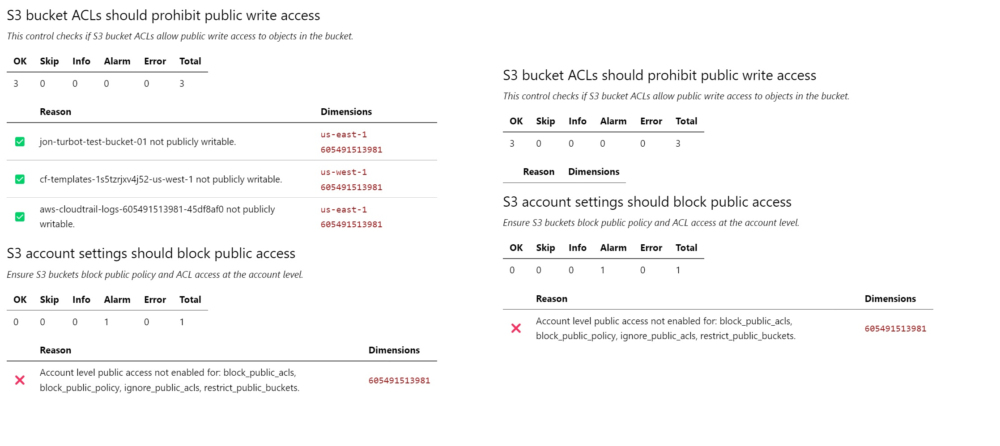

# Overview

Steampipe provides a templating mechanism for control outputs, based on the golang `text/template` package. For each output format there's a directory, in `~/.steampipe/check/templates/`, that minimally includes a file called `output.tmpl`. The name of the directory defines the name of an output format. The content of `output.tmpl` defines how to unpack and format a golang struct, called `Data`, that's passed to the template.

In [Writing Control Output Templates](https://steampipe.io/docs/develop/writing-control-output-templates) we give an example that defines a new output type called `summary` that works like this:

```
steampipe check --output=summary all
```

```
Summary for Zoom Compliance

total: 185
passed: 119
failed: 66
skipped: 0
```

We'll add more examples here.

# Suppress OK rows

You can use the `--output brief` argument to produce a plaintext output that does this. But suppose you want to suppress OK rows using Markdown format? You can do that by altering the existing `~/.steampipe/check/templates/md/output.tmpl`, or you can create a variant Markdown format. We'll do the latter here.

```
$ cd ~/.steampipe/check/templates`
$ mkdir briefmd
$ cd briefmd
$ cp ../md/output.tmpl .
```

We'll change from:

```
{{ define "control_row_template" }}
| {{ template "statusicon" .Status }} | {{ .Reason }}| {{range .Dimensions}}`{{.Value}}` {{ end }} |
{{- end }}
```

To:

```
{{ define "control_row_template" }}
{{ if ne .Status "ok" }}{{ template "statusicon" .Status }} | {{ .Reason }}| {{range .Dimensions}}`{{.Value}}` {{ end }} |{{ end }}
{{- end }}
```

That will suppress detail rows when `Status` is `ok`.

We can export to both formats using a single command.

```
steampipe check benchmark.public_access --export output.md --export output.briefmd
```

Since your Markdown viewer likely won't recognize the `.briefmd` extension, you might want to rename to `output.md`. Alternatively you could use `--output briefmd` and pipe the output to `output.md`.

```
steampipe check benchmark.public_access --output briefmd > output.md
```

Here's a comparison of the original Markdown output and the modified output. Everything else is the same, and you can see the count of `OK` results for each control, but the details are suppressed.




