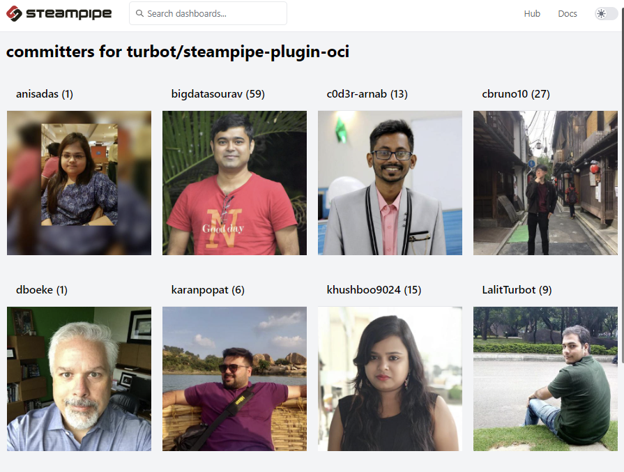

This example showcases the [image](https://steampipe.io/docs/reference/mod-resources/image) feature of Steampipe Dashboards. To run it, visit this directory and run `steampipe dashboard`. 

To build for another repo, e.g. `steampipe-plugin-aws`:

- Run the code in `avatars.sql` to create the `avatars` function.

- `alias spsql="psql -h localhost -p 9193 -d steampipe -U steampipe"`

-  `spsql -c "copy (select * from avatars('turbot/steampipe-plugin-aws')) to stdout with delimiter ',' csv header" > avatars.csv`

- `python avatars.py > mod.sp`

